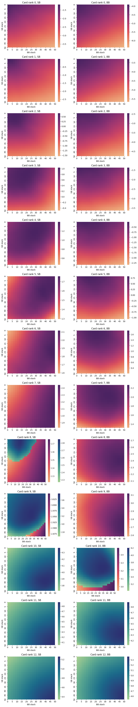

# Pocker Rl

RL agent for playing simplified version of pocker.

## Game rules

2 players. Each agent is given a single card. There are 52 cards in the deck. Players start with either Small Blind or Big Blind (**SB**/**BB**). **SB** = 1; **BB** = 2. **SB** is always the first to move. 

Each player starts with a stack from 10 to 50 chips (effective stack can vary). 

Each agent can either push or fold. First **SB** either pushes or folds. If **SB** pushed, **BB** can call(push) or fold. If both players push, card ranks are comapred. Higher ranked card wins. If ranks are the same, reward is equally shared among the two.

Trained agent is able to play both as **SB** and **BB** given any stack in the mentioned range.

## Methods

Two versions of agents were implemented. 

First one aims to directly approximate the expected rewards, in which different states can result. It does so by keeping a table with all possible states and updating them through a sequence of games. This method doesnt suffer from overfitting and should theoretically converge to the best possible strategy given infinite number of training rounds. Its disadvantage is the lack of any generalisation capability. In practice this means, that while for some states we might have an adequate approximation of expected reward, for other very similiar states this approximation might be incorrect.

Second version of the agent utilises a neural network to learn the rewards. Underlying network has a significant capacity to learn the corner-cases, implied by the rules of the game. For this agent a bunch of extra tricks were used. The most noticable ones are a prioritised memory buffer, progressive randomness in agent's decisions, early stopping on synthetic data.

## Launch

`main.py` launches the training of different agents with different parameters and chooses the best one by having a swiss competition among trained agents. As a result, agents, configs and agent leadorboard are stored.

`best_model_result.ipynb` is used to evaluate the performance of the best agent.

## Results

Trained agent is able to win around **95%** games versus the agent, which acts randomly. Below one can find the representation of best agent's startegy. Red colour stands for **fold**, green stands for **push**, values correspond to the rewards, estimated by the agent.

Agent's behaviour is mostly aligned with our intuition on how to play the game:
1) When agent plays as **SB**, its actions are more aggressive. It can play **push** with lower ranked cards compared to **BB** (from **SB** position it plays **push** starting from card rank 8; as **BB** - from rank 10). One can say, that even in the scop of a single round **SB** tends to bluff.
2) Having the highest ranked card, agent correclty assumes, that maximum reward is achieved when both **SB**'s and **BB**'s stackes are maximal.
3) In the same way, having the lowest ranked cards, agent coorectly assumes, that damage is minimized, when both parties have minimal stackes.
4) When stackes are not too high, agent can risk and play **push** even with not-too-good cards.

